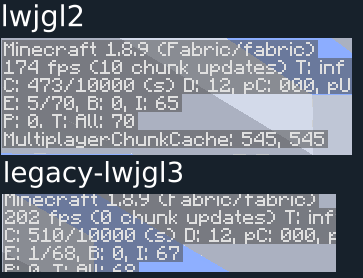

# legacy-lwjgl3

A hacky over-engineered project that runs LWJGL3 for Minecraft b1.7.3,
allowing you to use modern LWJGL features and libraries on older Minecraft versions.

### Table of Contents
 * Usage
   * [Dev Environments](#dev-environments)
   * [Clients](#Clients)
 * [Performance Increases?](#performance-increases) 

## Credits
A whole lot of this code is just code from the original LWJGL2 project modified to work with LWJGL3.

Thanks to gudenau for the original <https://github.com/gudenau/MC-LWJGL3>, a big portion of this code is from that project.

Further changes in fork are based on yet another fork: <https://github.com/Lassebq/legacy-lwjgl3>

# Usage

## Dev Environments
First head over to https://jitpack.io/#Adventurecraft-Awakening/AC-LWJGL3-Injector and select the latest version in commits

then add this to your build.gradle replacing %VERSION% with the git commit version of your choosing
```groovy
❯ build.gradle

import org.gradle.internal.os.OperatingSystem

project.ext.lwjglVersion = "3.3.2-SNAPSHOT"

switch (OperatingSystem.current()) {
    case OperatingSystem.LINUX:
        project.ext.lwjglNatives = "natives-linux"
        break
    case OperatingSystem.MAC_OS:
        project.ext.lwjglNatives = "natives-macos"
        break
    case OperatingSystem.WINDOWS:
        def osArch = System.getProperty("os.arch")
        project.ext.lwjglNatives = osArch.contains("64")
                ? "natives-windows${osArch.startsWith("aarch64") ? "-arm64" : ""}"
                : "natives-windows-x86"
        break
}

repositories {
   maven { url 'https://jitpack.io' }
}

dependencies {
    implementation "com.github.Adventurecraft-Awakening:AC-LWJGL3-Injector:%VERSION%"
    implementation platform("org.lwjgl:lwjgl-bom:$lwjglVersion")

    runtimeOnly "org.lwjgl:lwjgl::$lwjglNatives"
    runtimeOnly "org.lwjgl:lwjgl-assimp::$lwjglNatives"
    runtimeOnly "org.lwjgl:lwjgl-glfw::$lwjglNatives"
    runtimeOnly "org.lwjgl:lwjgl-openal::$lwjglNatives"
    runtimeOnly "org.lwjgl:lwjgl-opengl::$lwjglNatives"
    runtimeOnly "org.lwjgl:lwjgl-stb::$lwjglNatives"
}

configurations.all {
    // Removes LWJGL2 dependencies
    exclude group: "org.lwjgl.lwjgl"
}
```

## Clients
 Shaded builds are not currently published, so you will have to build them yourself.

 TLDR: `./gradlew remapShadowJar` then add `build/libs/*-all-remapped.jar` to your mods, done
 <br>
 <br>
 <br>

 Longer version: in the directory containing the file `build.gradle` run the command `./gradlew remapShadowJar`

 this will create 2 new files in the folder `build/libs`, add the file ending with `-all-remapped.jar` to your list of mods and run the game
 
# Performance Increases?
While increasing performance was not the main point you do very much do see a benefit from LWJGl 3's quite substantial performance increase,
resulting in a bump of about 20 fps (for me) even while having to emulate a lot of lwjgl 2 code that got removed.

 <br>
The settings used
```yaml
JDK: temurin-17 (Adopt OpenJDK Hotspot 17)
JVM Options:
  -client
  -server
mods:
  - fabricloader 0.13.3,
  - java 17,
  - minecraft 1.8.9
World seed: 123
Options changed from default:
  - Map FPS: unlimited
  - Use VBOS: true
  - VSync: Disabled
```

## Contributing
This project is a work in progress, if you have any suggestions or want to contribute feel free to open an issue or pull
request<br>
